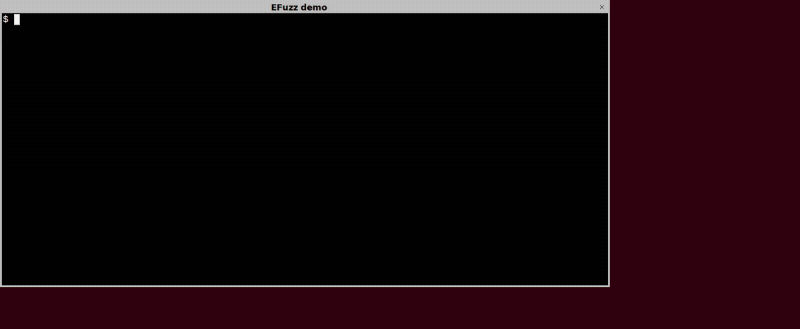
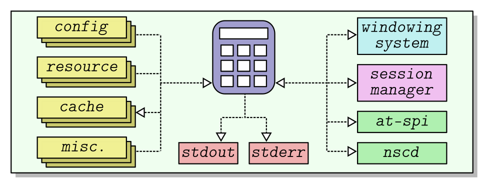

Program Environment Fuzzing (EFuzz)
===================================

EFuzz (&#x3B5;Fuzz) is a new type of fuzzer that can **fuzz just about
anything**, including:

* Network servers/clients
* *Graphical User Interface* (GUI) applications
* Editors
* Compilers
* Databases
* *any other Linux user-mode software*, etc.

For example, the following demo shows how to fuzz a *GUI application*
using EFuzz:

---

Demo of EFuzz fuzzing a GUI application binary (`gnome-calculator`).
First, the app is run normally, and all environmental interactions (including
user inputs) are recorded to a file.
Next, the app is fuzzed, this time by repeatedly replaying the original
recording but with one or mutations applied.
EFuzz quickly finds several crashes, as highlighted in red.

---

Unlike existing fuzzers, which only fuzz a specific input source (like AFL),
EFuzz fuzzes the **entire interaction** between the subject and its
environment (&#x3B5;).
In other words, the environment (&#x3B5;) itself is the fuzz target---a.k.a.
*program environment fuzzing*.
Here, the environment includes all files (configuration, cache, resource,
fonts, etc.), sockets (session manager, accessibility service, name service,
etc.), user interactions via the windowing system (mouse movements, button
clicks, etc.), special files, devices, and standard streams, as illustrated
below:

Basically all inputs---regardless of source or type---are considered to be
part of the environment, and will be fuzzed by EFuzz.
This even includes user interactions via the windowing system, which are
treated as just another input source, no different than any other socket or
file.
This makes EFuzz very comprehensive, as it will automatically fuzz all inputs
and combinations of inputs, even obscure inputs that are normally overlooked
in a typical fuzz campaign.

EFuzz is also very general, and is designed to fuzz off-the-shelf user-mode
Linux binaries with **zero configuration or set-up**.
See the demo above.

How EFuzz Works?
----------------

EFuzz is based on an underlying full environmental *Record and Replay* (rr)
and fuzzing infrastructure (RR+Fuzzing=RRFuzz).
The infrastructure is based on the insight that for typical user-mode
programs, all environmental interactions pass through the kernel-user mode
boundary.
Thus, by recording this boundary, we also implicitly record the program's
interaction with the environment, which then can be subject to fuzzing.
Basically, EFuzz works in two phases:

1. A *Recording* phase that executes the program normally, and records all
   interactions (e.g., system calls, signals, thread switches, etc.) between
   the subject and its environment into a file.
2. Next, a *Replay-with-Fuzzing* phase that repeatedly re-executes the program
   in a fuzzing loop.
   However, this time the original environmental interactions are replayed
   from the recording, but with one or more possible mutations applied.
   These mutations can induce new program behaviours and possible crashes.

Since EFuzz works at the abstraction of environmental interactions, it can
fuzz a very diverse range of subjects without any special-case handling.
This makes EFuzz powerful and easy-to-use.

An example of EFuzz usage is shown in the simple demo above:

1. The first phase **records** the `gnome-calculator` app using the command:

        $ ./EFuzz record gnome-calculator

    This creates an `out/` sub-directory, and the recording is stored in a
    `out/RECORD.pcap.gz` file.

2. The second phase **fuzzes** the `gnome-calculator` app using the command:

        $ ./EFuzz fuzz

   The fuzzer uses the original recording from step (1.) as the initial seed,
   and repeatedly re-executes the program.
   Rather than replaying the original recording exactly, the fuzzer will
   apply one (or more) mutations, inducing new program behaviours and
   possible crashes.

Discovered crashes are stored in the `out/crash/` sub-directory, and can be
replayed using the command:

        $ ./EFuzz replay out/crash/SIGSEGV_XXXX_m0YYYY.patch

We applied EFuzz to a diverse range of programs and discovered several new
bugs, including those that are difficult or impossible to find with
traditional fuzzers.
For more information, please see the preprint listed below.

Building
--------

To build EFuzz, simply run the `build.sh` script.

        $ ./build.sh

This has only been tested on Ubuntu-based systems.

EFuzz Usage
----------

Record:

        $ ./EFuzz record -- vim hello.txt

Replay:

        $ ./EFuzz replay

Fuzz:

        $ ./EFuzz fuzz

Replay crash:

        $ ./EFuzz replay out/crash/CRASH_SIGSEGV_1.patch

Debug crash:

        $ ./EFuzz replay out/crash/CRASH_SIGSEGV_1.patch -d

EFuzz also supports (optional) AFL-style coverage instrumentation:

Instrument program binary:

        $ ./EFuzz instrument program

This will generate an instrumented `program.rr` binary, that can be
substituted for the original.

It is also possible to instrument library code:

        $ ./EFuzz instrument /path/to/library.so

This will place an instrumented version of the library into the `lib/`
sub-directory, which is included in the library search path.

EFuzz Files
-----------

During fuzzing, several files will be generated:

- `out/COMMAND.cmd`: The command-line
- `out/RECORD.pcap.gz`: The recording
- `out/crash/*.patch`: Crashing patches
- `out/hang/*.patch`: Hanging patches
- `out/abort/*.patch`: Aborting patches
- `out/queue/m*/*.patch`: Interesting patches
- `lib/`: Location where the patched `libc` and instrumented libraries are stored.

Note that interactions stored in the `out/RECORD.pcap.gz` file can be viewed
using Wireshark.

EFuzz Technical Information
---------------------------

EFuzz uses [E9Patch](https://github.com/GJDuck/e9patch) to statically rewrite
all `syscall` instructions in `libc`.

* https://github.com/GJDuck/e9patch

Thus, whenever the program invokes a system call (e.g., `open`, `read`,
`write`, etc.), the call will be diverted to our record-and-replay infrastructure
(RR+Fuzzing=RRFuzz).
For recording, the infrastructure acts as a *man-in-the-middle* between user
and kernel-mode, and all interactions are saved to a file.
For replay (with fuzzing), the program is (repeatedly) executed again, but
this time each system call is *replayed* from the original recording, possibly
with one or more mutations applied.
During replay, system calls are almost entirely serviced from the recording,
and there is no interaction with the kernel and the real environment.
In addition to `libc` system calls, EFuzz also special methods for handling
the vDSO, signals, thread switches, and syscall instructions outside of
`libc`.
EFuzz does not use ptrace.

One problem is that program behaviour can (and will) diverge after a mutation
is applied.
Indeed, the main point of fuzzing is to induce new behaviours in the hope of
finding new bugs.
To handle this case, EFuzz resorts to "system call emulation" after
mutation, in a "relaxed" replay-mode.
This allows for diverse program behaviours to be explored using only the
original recording.
Please see the preprint below for more information.

EFuzz Status
------------

Implementing a full environmental record and replay infrastructure is
notoriously challenging.
For example, the related `rr-debug` project estimates a total of *five
person-years total* ([source](https://arxiv.org/pdf/1705.05937)) was spent on
development (as of 2017), and even then it cannot perfectly record and replay
all programs.
Our underlying RRFuzz framework has not nearly had as much development time, and
the current implementation should be viewed as a "research prototype"
that will not necessarily work for all programs.
Nevertheless, we provide the system "as-is", *since EFuzz has been proven
effective at finding bugs that other fuzzers cannot detect*, even if the
implementation is not fully polished.

We will continue to develop and improve EFuzz depending on the level of
interest from the community.

EFuzz Issues
------------

Please keep in mind that EFuzz is alpha-quality software and a research prototype.

Please report obvious bugs here:

* https://github.com/GJDuck/RRFuzz/issues

Issues relating to unexpected divergence during replay should generally not be
reported.
That said, pull requests that fix divergence issues are very welcome.

Similarly, issues relating to missing ioctls, fcntls, and prctls should not be
reported.
Instead, you should update the corresponding `.tab` file if possible, and
consider making a pull request.

Acknowledgement
---------------

This research is supported by the National Research Foundation, Singapore,
and Cyber Security Agency of Singapore under its National Cybersecurity R&D
Programme (Fuzz Testing NRF-NCR25-Fuzz-0001).  Any opinions, findings and
conclusions, or recommendations expressed in this material are those of the
author(s) and do not reflect the views of National Research Foundation,
Singapore, and Cyber Security Agency of Singapore.

Preprint
--------

* Ruijie Meng, Gregory J. Duck, Abhik Roychoudhury, [*Program Environment Fuzzing*](https://arxiv.org/abs/2404.13951), 2024

